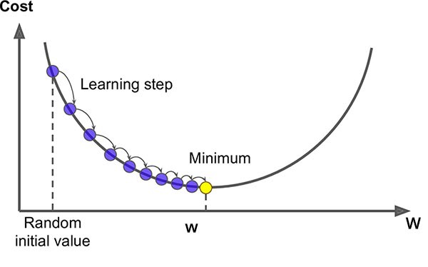
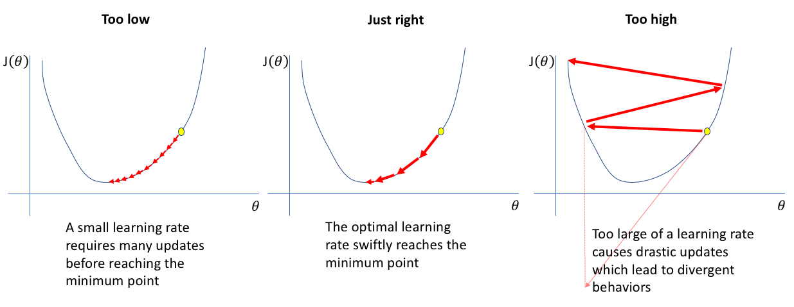

  

 Visual Representation of Gradient Descent 

---
# Gradient Descent
Gradient descent is a method for finding the local minimum of of an objective function. Gradient descent one of the most well-known and popular methods finding the optimal weight values for many machine learning algorithms. Each machine learning algorithm calculates a cost function $J(\theta)$ to determine the error, or cost, between predicted and actual labels. Gradient descent calculates the direction that minimizes $J(\theta)$ and takes a "step" in that direction. This sequence is repeated until the optimal solution minimizing $J(\theta)$ is found.

## Variations
Gradient descent has 3 variations: batch, stochastic, and mini-batch gradient descent. Each variation takes a slightly different approach in how we calculate the direction to take a step in. 

### Batch Gradient Descent
Batch gradient descent calculates the gradient of the cost function with respect to $\theta$ for the entire set at once using the equation:

$
\nabla_{\theta} J(\theta) = \frac{1}{m}\sum_{i=1}^m[(\hat{y}^i - y^i)*x^i]
$

which is used to update $\theta$ following:

$
\theta = \theta - \alpha\nabla_{\theta} J(\theta)
$

Batch gradient descent requires the gradients for *entire* dataset to be calculated for each step. While this is not an issue for many practical datasets, it is important to keep in mind as datasets and features grow larger. Batch gradient descent could cause time and memory allocation issues for large datasets. Another potential issue with batch gradient descent is that it will converge to the first local minimum in the direction of the initial step. This can risk can be mitigated by running the algorithm multiple times with random starting points and comparing the end costs of each run. 

### Stochastic Gradient Descent
$
\theta = \theta - \alpha\nabla_{\theta} J(\theta; x^{i}; y^{i})
$

Where batch gradient descent calculates the gradient of the entire series, stochastic gradient descent calculates the gradient on of one randomly selected feature vector of the dataset, taking a step in the direction that minimizes its error with respect to $\theta$. Stochastic gradient descent itself is not an efficient way to find the value of $\theta$ that minimizes $J(\theta)$, however decreasing the learning rate $\alpha$ each iteration can allow it to converge to local or global minimums. This randomness, however, does provide a benefit in that stochastic gradient descent is less likely to get "stuck" at the first local minimum. 

### Mini Batch Gradient Descent
$
\theta = \theta - \alpha\nabla_{\theta} J(\theta; x^{i:i+n}; y^{i:i+n})
$

Mini-batch gradient descent combines the increased efficacy of batch gradient descent with the reduced computational complexity and randomness of stochastic gradient descent. Mini-batch gradient descent randomly selects feature vectors i to i+n where n is some pre-defined length and calculates the gradient. This reduces the chaotic nature of choosing only one feature vector to calculate the gradient, but reduces the total number of calculations required. 

## Hyper parameters
Gradient descent has one hyperparameter to tune: $\alpha$. Alpha is the "learning rate", or how much impact each step has when updating $\theta$. $\alpha$ is a value between 0 and 1 and should be tuned such that each iteration has a great enough impact that the algorithm does not stall before reaching a local minimum, but small enough that the algorithm does not overcorrect and "overshoot" the minimum. 

  

## Issues
Gradient descent is an incredibly useful algorithm to find optimal weights for a range of machine learning applications. The biggest issue with gradient descent is the potential to be stuck at local minimums, and the inability to determine if the minimum is local or global. While this can be mitigated by starting at random points multiple times, there is still no way to tell if there a better solution exists. 
