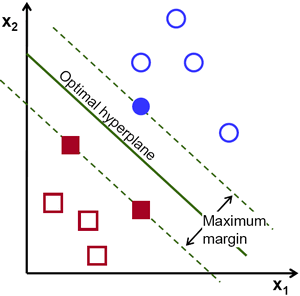

# [Support Vector Machine](https://scikit-learn.org/stable/modules/generated/sklearn.svm.SVR.html)
*Regression*

---

## [Synopsis](https://en.wikipedia.org/wiki/Support-vector_machine)
A Support Vector Machine (SVM) is a supervised learning model first developed at AT&T Bell Laboratories by Vladimir Vapnik. SVMs are based on statistical learning frameworks. An SVM algorithm builds a model that can separate data into binary classifications by drawing a line between the data. SVMs are incredibly powerful and can be used in classification, regression, and outlier detection tasks. Classification SVMs have the following variations:

### Linear SVM
- attempts separates the data with a straight line
    - Hard-Margin
        - If the data is linearly separable, a line can be drawn such that it maximizes the distance between itself and the nearest datapoints on either side. 
        - All instances must be classified on the appropriate side of the line (i.e. $w^Tx - b \geq 1$ produces a label of 1)
    - Soft-Margin
        - Allows a balance between "street" violations where a feature vector falls within the established margins of the hyperplane
        - Less sensitive to outliers which would force the hard margin to compensate for. When using the Sci-kit Learn SVM module, this is the C parameter
### Nonlinear SVM
- allows a nonlinear function to separate the dataset, called a Kernel
    - Polynomial Kernel
        - separates the data using a polynomial function
    - Gaussian Radial Basis Function (RBF)
        - $\phi_y(x, l) = exp(-\gamma\|x-l\|^2)$
        - This is a bell-shaped function and can provide great flexibility in separating the data

### Kernel Trick
We can implement polynomial functions via a kernel so that we do not actually have to waste resources on computing high order polynomials. This increases the feasibility of calculating high order polynomials in large datasets where otherwise the calculations would consume too many resources and time. 

- Linear: $K(a,b) = a^Tb$
- Polynomial: $K(a,b) = (\gamma a^Tb + r)^d$
- Gaussian RBF: $K(a,b) = exp(-\gamma\|a - b\|^2)$
- Sigmoid: $K(a,b) = tanh(\gamma a^Tb + r)$

The benefits of an SVM are:
- works well when there is a clear margin of separation
- effective in high dimensions
- relatively memory efficient

The issues with an SVM are:
- not suitable for large datasets
- does not perform well when data is noisy
- no probabilistic explanation for the classification 

SVMs are incredibly powerful, however care needs to be taken when selecting data and training the model. Outliers and noisy data can cause the model to be ineffective. In SVM Regression, instead of the hyper plane forming a basis for classification, it guides the regression line subject to a minimization and constraints.

## Prediction
A prediction with an SVM is made using the central line of the hyperplane. The hyperplane is create by minimizing the following:

$\frac{1}{2}\|w\|^2 + C\sum_{i=1}^N(\xi_i + \xi_i^*)\\$ 
$subject to\\$
$y_i - wx_i-b\leq\varepsilon+\xi_i\\$
$wx_i+b - y_i\leq\varepsilon+\xi_i^*\\$
$\xi_i,\xi_i^*\geq 0$

### Predict
$$
\hat{y} = \sum_{i=1}^n(a_i-a_i^*(\phi(x_i),\phi(x))+b)
$$

## Error Analysis
After training the model, we will test the model by predicting the test set feature vectors and comparing it to the actual labels. The measurements we will use to calculate the error of each model is the Mean Squared Error and the Mean Absolute Error. These metrics provide complimentary error analysis for each model and will allow us to compare how well they do relative to each other. 

Mean Squared Error:
$
MSE = \frac{1}{n}\sum_{i=1}^{n}(y_i - \hat{y_i})^2
$

Mean Average Error:
$
MAE = \frac{1}{n}\sum_{i=1}^{n}(|y_i-\hat{y}_i|)
$

We will then compare the results with each model to determine the best model for our dataset. 
