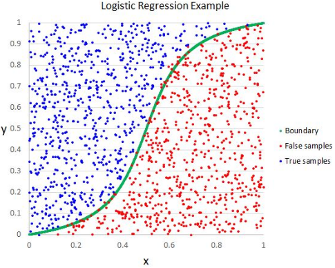

# [Logistic Regression](https://scikit-learn.org/stable/modules/linear_model.html#logistic-regression)

---

## [Synopsis](https://en.wikipedia.org/wiki/Logistic_regression)
Despite the name, *logistic Regression* is a classification algorithm developed to model population growth in the 1830s by Pierre Francois Verhulst. In machine learning, it yields the probability of a binary event happening. It can be extended to multi0label classification by assigning a probability between 0 and 1 to each object where the sum of all object probabilities is 1. Logistic regression itself is not a classifier, but rather models the probability of an output based on the input.

The benifits of an Logistic Regression are:
- easy to implement and interpret
- fast at classifying unknown data
- high accuracy for simple data sets

The issues with an Logistic Regression are:
- can easily lead to overfitting
- can only predict discrete functions
- constructs linear boundaries for predictions 

## Prediction
Like linear regression, logistic regression computes the weighted sum of the input features. Unlike linear regression, however, this sum is then passed through the sigmoid function to output the *logistic* of the result. The sigmoid function, denoted as $\sigma(t)$ outputs a number between 0 and 1 and is defined by $\sigma(t) = \frac{1}{1 + exp(-t)}$. This output is then used to predict if the an instance $x$ belongs to the specified class using

$$
\hat{y} = \begin{cases}
    1 &\text{if } \hat{p} \geq 0.5\\
    0 &\text{if } \hat{p} \lt 0.5
\end{cases}
$$

where $\hat{p} = h_\theta(x) = \sigma(\theta^tx)$

## Calculating Cost
The cost function of logistic regression is 

$$
c(\theta) = \begin{cases}
    -log(\hat{p}) \text{ if y = 1}\\
    -log(1-\hat{p}) \text{ if y = 0}
\end{cases}
$$

This cost function grows large as t approaches zero, so the cost will be large if a prediction differs from the true label, and is small when the prediction matched the true label. The cost function can be written as the average of each instance, as shown below:

$
J(\theta) = -\frac{1}{m}\Sigma^m_{i=1}[y^ilog(\hat{p}^i + (1-y^i)log(1-\hat{p}^i)]
$

The function above is convex, so we can apply gradient descent to minmize the cost function and be guaranteed to find the global minimum -- assuming the learning rate is not too large and it is given enough time. The gradient, or partial derivative, is:

$
\frac{\partial}{\partial\theta_j} = \frac{1}{m}\Sigma^m_{i=1}(\sigma(\theta^Tx^i) - y^i)x^i_j
$

## Error Analysis
After training the model, we will calculate the confusion matrix and F score to compare to the other models. The confusion matrix shows the predicted vs actual labels in an easily readible format. The F score is a ratio between the precision and recall.

Precision is calculated using the equation:
$
precision = \frac{true positives}{True Positives + False Positives}
$

Recall is calculated using the equation:
$
recall = \frac{True Positives}{True Positives + False Negatives}
$

The F score is calculated using the equation:
$
F = \frac{precision*recall}{precision + recall}
$

These metrics will allow us to easily compare the models.
