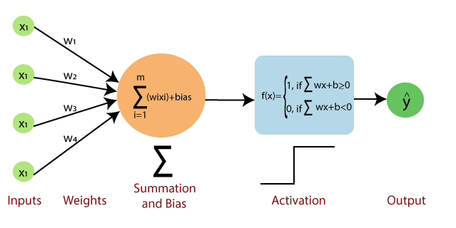
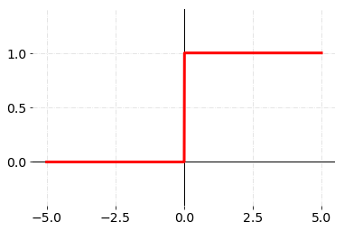

# **The Perceptron**

[The Perceptron](https://en.wikipedia.org/wiki/Perceptron) is a supervised, single layer neural network binary classifier first developed by Frank Rosenblatt in 1958. The Perceptron models a single neuron and multiple layers can be combined into a Multi-Layer Perceptron, or MLP. The Perceptron applies weights to input feature vectors and applies an activation function to yeild a classification. 

## *Training the Perceptron*
Training the perceptron is a 3-phased process. Phase 1 is the data processing, Phase 2 is the application of weigths and an activation function to yield a predicted result, and Phase 3 is the weight update to minimize the error. Phases 2 and 3 are repeated multiple times - called the *epoch* count - until a desired tollerance is reached. 

### **Phase 1** - Data Processing
The Perceptron is a binary classifier, meaning the result is meant to classify the input into two groups -- yes/no, black/white, up/down, etc. This output is a 1/0 or 1/-1 depending on activation function chosen. To prepare the data, first we must determine the two output groups, then classify data in numerical terms.

The data is now in a format that will allow the perceptron to be trained.

### **Phase 2** - Predict a Result
### Choosing the Activation Functions
The activation function is how the input data will be interpreted. The activation function associated with the perceptron is the sign activation function, which classifies any output less than 0 as -1, and any output greater than or equal to 0 as 1. This is very similar to the binary step [activation function](https://towardsdatascience.com/getting-to-know-activation-functions-in-neural-networks-125405b67428). The binary step function suites this application better. 

### *Step Function*
The Step Function takes the summed weighted data and returns 0 for any negative number, or 1 for any postitive number. 

Our prediction will be:
$
\large \hat{y}^{i} = \text{step}(w^{T}\bar{X}^{i})
$

### **Phase 3** - Update Weights
### Weight Update
Once a prediction is made, we will compare it to the true label to determine if our prediction was correct. The weights will be adjusted using the following equation:

$
\large w \rightarrow w - \alpha(\hat{y}^{i} - y^{i})\bar{x}^{i}
$

The new weight will be the difference between the predicted and actual results multiplied by the feature vector and some learning rate $\alpha$ where $0 < \alpha \leq 1$. This result is then subtracted from the initial weight. If we predict the correct label, our weight adjustment will be zero. If we are too high, the weight will decrease. If we are too low, the weights will increase.  

## Testing
Once the perceptron is trained, we will verify the accuracy using data the algorithm has not seen before. We will calculate the F1 score to determine how well we are performing. The F1 score is calculated as follows:

$
\large \text{F1} = 2\times \dfrac{Precision * Recall}{Precision + Recall}
$

Where:
$
\large \text{Precision} = \dfrac{\text{True Positive}}{\text{True Positive + False Positive}}
$

And:
$
\large \text{Recall} = \dfrac{\text{True Positive}}{\text{True Positive + False Negative}}
$