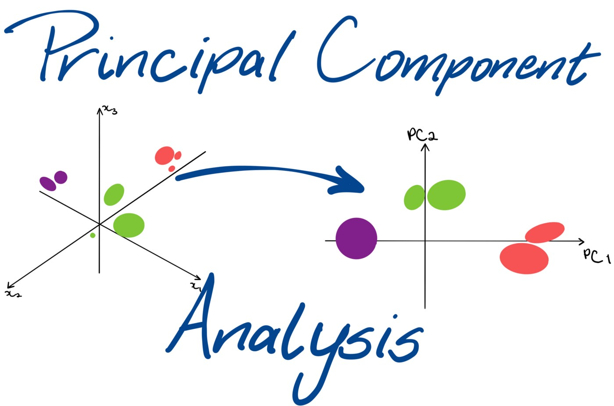

# [Principle Component Analysis](https://scikit-learn.org/stable/module/generated/sklearn.decomposition.PCA.html)

---

## [Synopsis](https://en.wikipedia.org/wiki/Principal_component_analysis)
Principal Component Analysis (PCA) was created in 1901 by Karl Pearson. PCA is the process of computing the process of computing the principal components and using them to perform a change of basis on the data. This method is commonly used for dimensionality reduction by projecting each datapoint onto only the first few principal components to obtain lower dimensionality. 
PCA can be thought of as fitting a n-dimensional ellipsoid to the data where each axis of the ellipsoid represents a principal component. If an axis of the ellipsoid is small, the variance along the axis is small. Essentially, PCA seeks to define a hyperplane to project data onto while preserving the variance of the data. 

A useful metric for PCA is the explained variance ration which indicates the proportion of the dataset's variance that lies along each principal component. This measurement will give a percentage of variance that lies along a principle component. If reducing dimensionality for visualization, we will always reduce to 2 or 3 (the maximum of dimensions that can be represented visually). Otherwise, a good tactic is to choose the number of dimensions that add up to a sufficiently large number of the variance. 

PCA is a powerful technique that can be used for many things including compression and dimensionality reduction. While information is lost when using PCA, it can allow you to visualize the dataset and the implemented algorithm. Here, we will implement it to visualize our regression models and view the change in MSE and MAE if we implement PCA to visualize the data.
