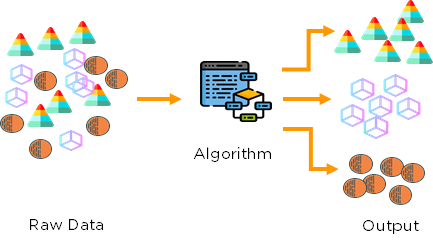

---

# [Unsupervised Learning](https://en.wikipedia.org/wiki/Unsupervised_learning)

Unsupervised Learning is a category of machine learning where algorithms used to shed light on the data. In this repository, we will implement PCA and K-Means Clustering algorithms. These are to common unsupervised machine learning algorithms that can be incredibly powerful. PCA is used for dimensionality reduction and K-Means is used to determine the number of clusters, or groups, within a dataset. 

In unsupervised learning, we do not know the labels and wish to find relationships within the data. As such error analysis and performance can be difficult. It is a mix of intuition and hyperparameter comparison. Unsupervised learning and clustering can be used to identify market segments or anomolies. 

In this repository, we will implement and develop intuition for PCA and K-means clustering algorithms.
