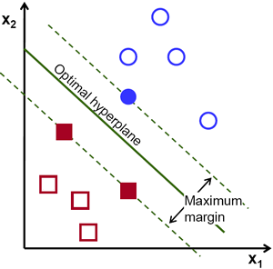

# [Support Vector Machine](https://scikit-learn.org/stable/modules/generated/sklearn.svm.SVC.html#sklearn.svm.SVC)
*Classification*

---

## [Synopsis](https://en.wikipedia.org/wiki/Support-vector_machine)
A Support Vector Machine (SVM) is a supervised learning model first developed at AT&T Bell Labroratories by Vladimir Vapnik. SVMs are based on statistical learning frameworks. An SVM algorithm builds a model that can seperate data into binary classifications by drawing a line between the data. SVMs are incredibly powerful and can be used in classification, regression, and outlier detection tasks. Classification SVMs have the following variations:

### Linear SVM
- attempts seperates the data with a straight line
    - Hard-Margin
        - If the data is linearly seperable, a line can be drawn such that it maximizes the distance between itself and the nearest datapoints on either side. 
        - All instances must be classified on the appropriate side of the line (i.e. $w^Tx - b \geq 1$ produces a label of 1)
    - Soft-Margin
        - Allows a balance between "street" violations where a feature vector falls within the established margins of the hyperplane
        - Less sensitive to outliers which would force the hard margin to compensate for. When using the Sci-kit Learn SVM module, this is the C parameter
### Nonlinear SVM
- allows a nonlinear function to seperate the dataset, called a Kernel
    - Polynomial Kernel
        - seperates the data using a polynomial function
    - Gaussian Radial Basis Function (RBF)
        - $\phi_y(x, l) = exp(-\gamma\|x-l\|^2)$
        - This is a bell-shaped function and can provide greate flexibility in seperating the data

### Kernel Trick
We can implement polynomial functions via a kernel so that we do not actually have to waste resources on computing high order polynomials. This increases the feasibility of calculating high order polynomials in large datasets where otherwise the calculations would consume too many resources and time. 

- Linear: $K(a,b) = a^Tb$
- Polynomial: $K(a,b) = (\gamma a^Tb + r)^d$
- Gaussian RBF: $K(a,b) = exp(-\gamma\|a - b\|^2)$
- Sigmoid: $K(a,b) = tanh(\gamma a^Tb + r)$

The benifits of an SVM are:
- works well when there is a clear margin of seperation
- effective in high dimensions
- relatively memory efficient

The issues with an SVM are:
- not suitable for large datasets
- does not perform well when data is noisy
- no probabilistic explanatino for the classification 

SVMs are incredibly powerful, however care needs to be taken when selecting data and training the model. Outliers and noisy data can cause the model to be ineffective. 

## Prediction
A prediction with an SVM is made by comparing a feature vector to the classifying hyperplane. 

### Predict
$$
\hat{y} = \hat{w}^T\phi(x^n) + \hat{b}
$$

where
$
\hat{b} = \frac{1}{n_s}\sum_{i=1}^m(t^i-\hat{w}^T\phi(x^i))
$

### Calculate Error
$J(w,b) = \frac{1}{2} w^Tw + C\sum_{i=1}^{m}max(0,1-t^i(w^Tx^i + b))$

### Gradient Step
$\sigma^L = \nabla_a C \otimes\sigma^\prime(z^L)$

Once a prediction is made, the error is calculated, then a gradient step is taken until the function reaches a minimum value.

## Error Analysis
After training the model, we will calculate the confusion matrix and F score to compare to the other models. The confusion matrix shows the predicted vs actual labels in an easily readible format. The F score is a ratio between the precision and recall.

Precision is calculated using the equation:
$
precision = \frac{true positives}{True Positives + False Positives}
$

Recall is calculated using the equation:
$
recall = \frac{True Positives}{True Positives + False Negatives}
$

The F score is calculated using the equation:
$
F = \frac{precision*recall}{precision + recall}
$

These metrics will allow us to easily compare the models.