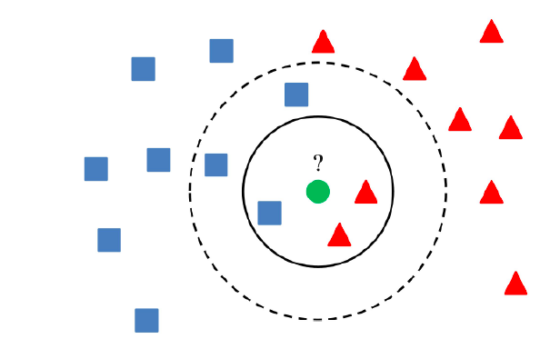

---
# K-Nearest Neighbors
with SciKitLearn

## Overview

[K-Nearest Neighbors](https://en.wikipedia.org/wiki/K-nearest_neighbors_algorithm) is an algorithm that can be used for both classification and predictive regression. When classifying, the KNN algorithm works associating the label of the majority of the "K" nearest neighbors. In regression, the output is the average of the "K" nearest neighbors. 

The intuition of KNN is that if a relationship exists between datapoints, predictions can be made using information provide by known datapoints. The more data avaliable, the more accurate the algorithm will be.

In this project, we will compare regressive KNN with linear regression on the [Real Estate](https://archive.ics.uci.edu/ml/datasets/Real+estate+valuation+data+setdataset).

The number of neighbors used for the calculation can be difficult to determine without running error analysis against different numbers of neighbors. The number of neighbors chosen should be "enough" such that the result determined is accurate enough to be useful, but not so much that the predictions are skewed by neighbors too far to be useful.  

## Strengths
### No triaining period
KNN works by calculating the the distance between the unknown and known datapoints, and using the closest "K" of them for prediction. There is no training period to fit a line or preliminary calculations to perform. 

### Easy implementation
Implementation of KNN is as simple as curating a dataset to compare new data to and creating a method to find the closest "K" neighbors. No additional packages or calculations are needed making KNN very easy to implement in any scenario.  

### Easy to add additional data
Training is not needed in KNN and the only calculations required are during predictions. Adding or updating the reference data is as simple as inserting or editing the data distances are calculated on. 

## Weaknesses
### Does not work well with a large dataset
Although training is not performed and a larger dataset increases the accuracy of predictions, distances must be caclulated against every entry in the reference dataset. As the reference dataset grows larger, every prediction will take longer. 

### Sensitive to outliers
KNN calculates the closest "K" neighbors to make predictions. If an outlier is one of the closest neighbors, the prediction will be biased towards the outlier. 

### Does not work well with high dimensionality
As dimensionality grows, distances become difficult to calculate.

## Variations
### Weighted Nearest Neighbor
Traditional nearest neighbors can be though of as applying a weight of $\frac{1}{k}$ to each of the "K" neighbors. [Weighted KNN](https://en.wikipedia.org/wiki/K-nearest_neighbors_algorithm#The_1-nearest_neighbor_classifier) closer neighbors are given heavier weights than further neighbors. This reduces the impact of outliers on the predictions.